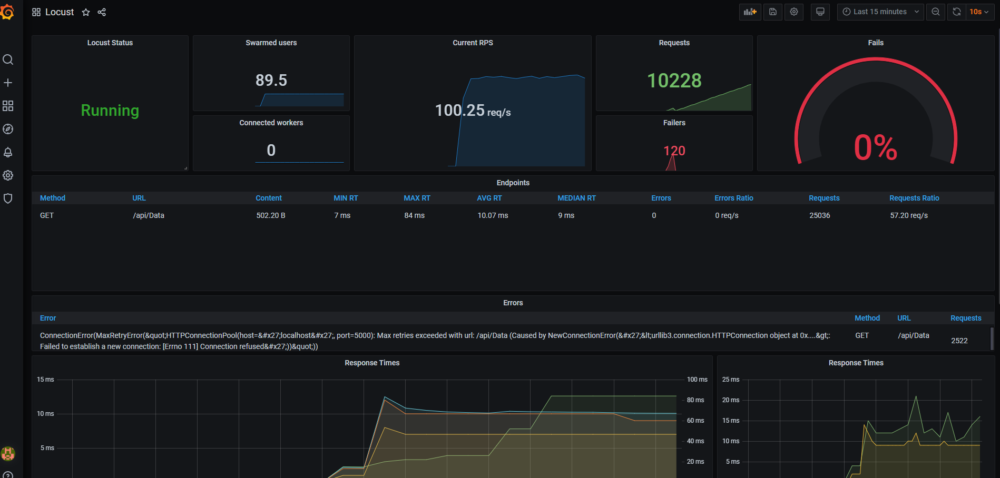
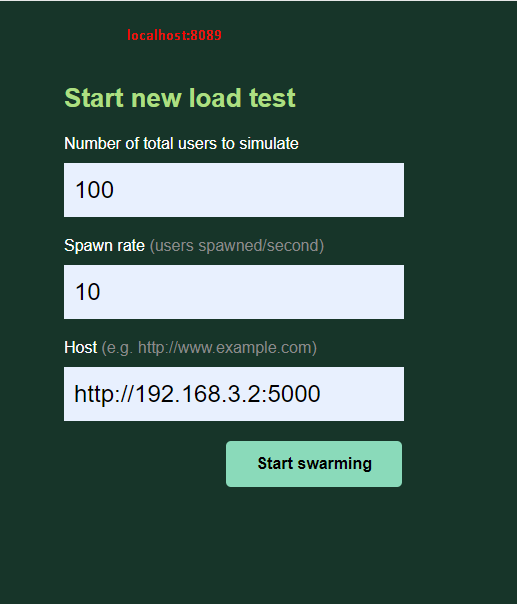
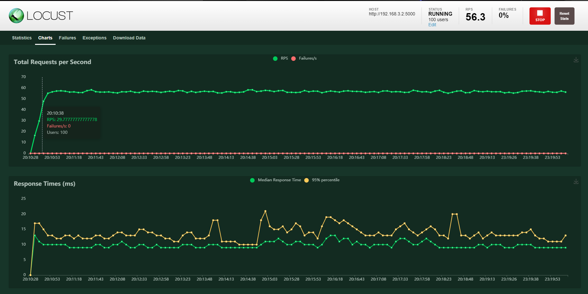
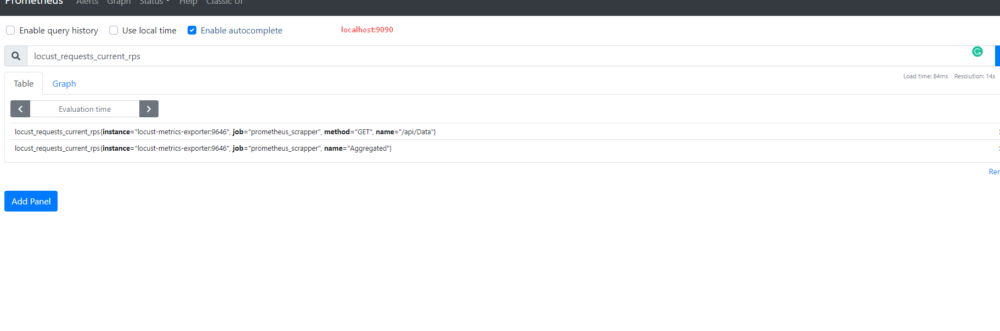
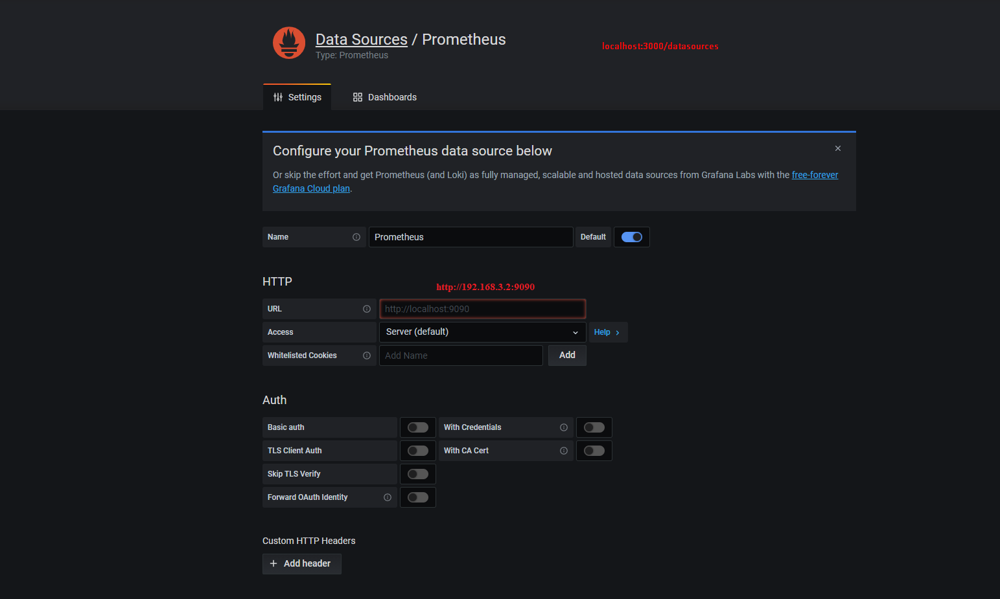
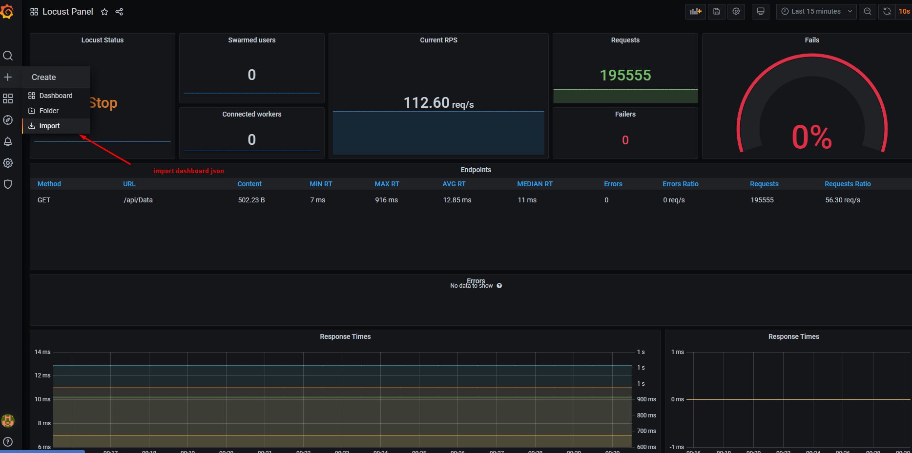

<h1><b>Installation</b>  </h1>

<ul>
 <li>1. Installing services using Docker Compose</li>
 <li>2. Locust Settings</li>
 <li>3. Prometheus Settings</li>
 <li>4. Grafana Settings</li>
</ul>
</br></br>

<h3>1. Installing services using Docker Compose</h3>
After downloading the project, open the file path through the console and type the command  </br>


```diff
docker-compose up --scale worker = 4
```
</br>
<h3>2. Locust Settings</h3>
Locust is an open-source testing tool, which allows us to specify loading scenarios by a Python code.
<p>Documentation : <a href="https://docs.locust.io/en/stable/quickstart.html" target="_blank">Locust</a></p>
<b>Locust access URL: localhost:8089</b> </br>
<b>Note : </b> locust_http.py : We write the url paths we want to see in Grafana to this file.</br>
<b>Note : </b> If you use localhost in the 'Host Url' section and get an error, use your ip address</br>




</br>
</br>



</br>
</br>

<h3>3. Prometheus Settings</h3>
Its main focus is to provide valid insight into system performance by providing a way for certain variables of that system to be monitored. We use Prometheus to show on graphana<br>
<b>Prometheus access URL: localhost:9090</b> </br>
<p>Documentation : <a href="https://prometheus.io/docs/introduction/overview/" target="_blank">Prometheus</a></p>

</br>



</br></br>
<h3>4.  Grafana Settings</h3>
According to GrafanaLabs, Grafana is an open source visualization and analytics software. It allows you to query, visualize, alert on, and explore your metrics no matter where they are stored.
<b>Note : You can use Grafana in databases such as Mysql. </b> </br>
<p>Documentation : <a href="https://grafana.com/docs/" target="_blank">Grafana</a></p>
<b>Grafana access URL: localhost:3000</b> </br>
<b>Username : admin</b> </br>
<b>Password : admin</b> </br></br>

First, add prometheus database via Settings->Database Tab or URL localhost:3000/datasources. Prometheus Host: 192.168.3.2:9090 (use your own ip)




</br>
after adding the database,  We import 'locust_dashboard.JSON' file for panel design.</br>



</br>

<h1>Now you are ready to use it</h1>

<h2>SOURCE : <a target="_blank" href="https://medium.com/devopsturkiye/locust-real-time-monitoring-with-grafana-66654bb4b32">BLOG</a></h2>

